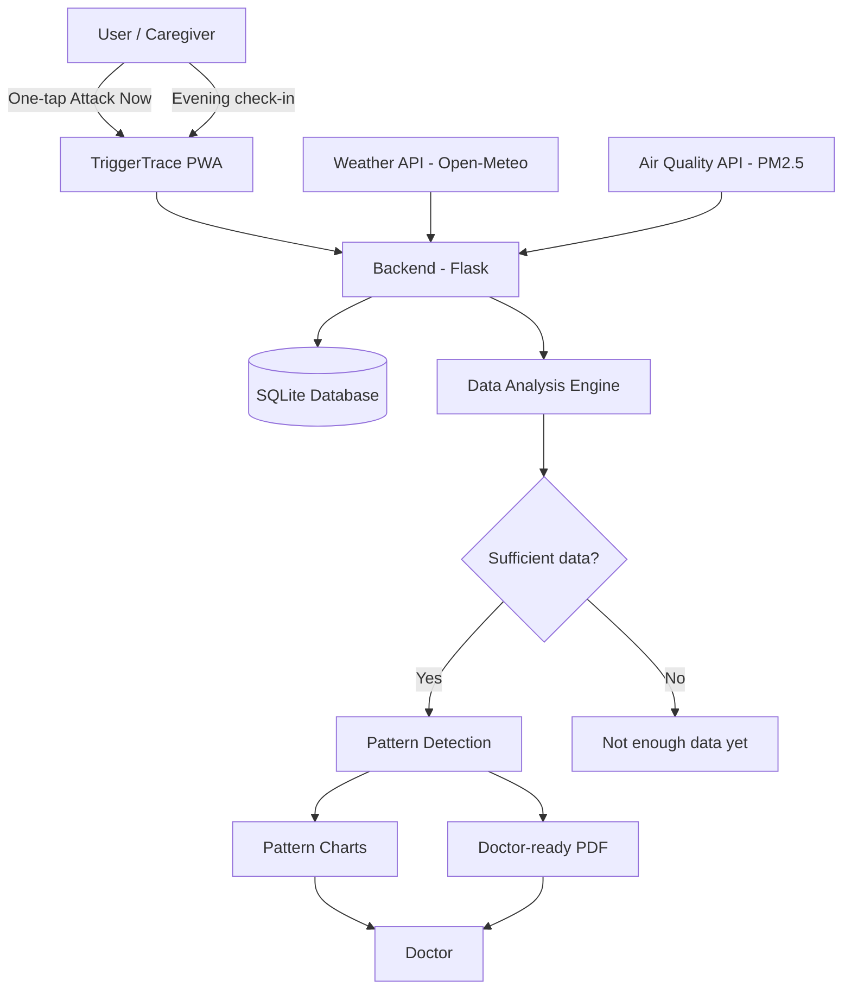

# TriggerTrace Data Flow

```mermaid
flowchart TD
  U[User / Caregiver] -->|One-tap Attack Now| P[TriggerTrace PWA]
  U -->|Evening check-in| P
  P --> B[Backend - Flask]
  W[Weather API - Open-Meteo] --> B
  A[Air Quality API - PM2.5] --> B
  B --> D[(SQLite Database)]
  B --> E[Data Analysis Engine]
  E --> Q{Sufficient data?}
  Q -->|Yes| PD[Pattern Detection]
  Q -->|No| N[Not enough data yet]
  PD --> C[Pattern Charts]
  PD --> R[Doctor-ready PDF]
  C --> DR[Doctor]
  R --> DR
```
